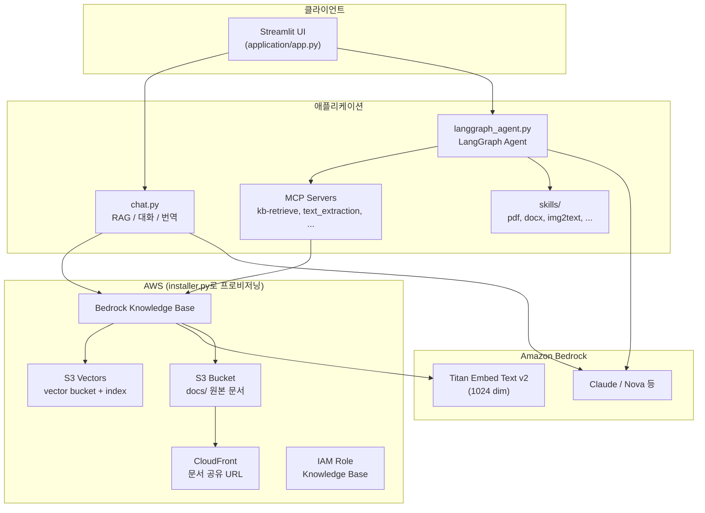

# RAG with Amazon S3 Vectors

Amazon Bedrock Knowledge Base와 **Amazon S3 Vectors**를 벡터 스토어로 사용하는 RAG(Retrieval-Augmented Generation) 애플리케이션입니다. Streamlit 기반 채팅 UI에서 일반 대화, RAG 검색, LangGraph Agent(SKILL/MCP), 이미지 분석, 번역 등 다양한 모드를 제공합니다.

## S3 Vectors 개요

S3 Vector는 스토리지 서비스인 S3를 직접 사용하는 벡터 검색 기능으로서, 벡터 데이터를 저장하고 유사도 기반 검색을 수행할 수 있는 서비스입니다. 텍스트, 이미지, 오디오 등의 데이터를 임베딩하여 저장하고 검색할 수 있습니다. 이는 서브초 단위의 빠른 쿼리 응답 시간, 수백만 개의 벡터에 대한 검색 지원, 90% 이상의 평균 검색 정확도(recall) 제공, 메타데이터 필터링 기능 지원, 다른 AWS 서비스들과의 통합 지원의 장점을 가지고 있습니다.

S3 Vector는 의미론적 검색(Semantic Search), 추천 시스템, 이미지/텍스트 유사도 검색, AI 기반 검색 애플리케이션, 대규모 벡터 데이터베이스 구축에 장점이 있습니다.

## 시스템 구성

### 아키텍처



### 데이터 흐름 (RAG)

1. 원본 문서를 S3 버킷의 `docs/` prefix에 업로드합니다.
2. Bedrock Knowledge Base가 문서를 청킹·임베딩하여 **S3 Vectors** 인덱스에 저장합니다.
3. 사용자 질의 시 `bedrock-agent-runtime`의 `retrieve` API로 관련 청크를 검색합니다.
4. 검색 결과를 LLM 컨텍스트로 전달하여 답변을 생성합니다.
5. 참조 문서 URL은 CloudFront `sharing_url`을 통해 제공됩니다.

### AWS 리소스 (`installer.py`가 생성)

| 리소스 | 이름 규칙 | 설명 |
|--------|-----------|------|
| S3 버킷 (문서) | `storage-for-rag-project-{accountId}-{region}` | RAG 원본 문서 저장 (`docs/`) |
| S3 Vector 버킷 | `{projectName}-{accountId}` | 벡터 임베딩 저장 |
| S3 Vector 인덱스 | `{projectName}` | cosine, 1024 dim, float32 |
| Bedrock Knowledge Base | `{projectName}` | S3 Vectors를 벡터 스토어로 사용 |
| IAM Role | `role-knowledge-base-for-{projectName}-{region}` | KB용 Bedrock/S3/S3Vectors 권한 |
| CloudFront | `CloudFront-for-rag-project` | S3 문서 정적 배포 (공유 URL) |
| Secrets Manager | `tavilyapikey-{projectName}` 등 | 외부 API 키 (선택, 현재 installer에서 주석 처리) |

기본 설정: `projectName = rag-s3-vector`, `region = us-west-2`, 임베딩 모델 `amazon.titan-embed-text-v2:0`.

### 애플리케이션 구조

```
rag-s3-vector/
├── installer.py             # AWS 인프라 프로비저닝
├── uninstaller.py           # AWS 인프라 삭제
├── requirements.txt
├── application/
│   ├── app.py               # Streamlit 메인 UI
│   ├── chat.py              # RAG, 대화, 번역, 이미지 요약
│   ├── langgraph_agent.py   # LangGraph Agent (SKILL + MCP)
│   ├── mcp_config.py        # MCP 서버 설정
│   ├── mcp_retrieve.py      # Knowledge Base retrieve
│   ├── mcp_server_retrieve.py
│   ├── mcp_server_text_extraction.py
│   ├── config.json          # installer가 갱신하는 런타임 설정
│   ├── skills/              # Agent용 SKILL (pdf, docx, img2text 등)
│   ├── contents/            # 로컬 문서 (선택)
│   └── artifacts/           # Agent 실행 결과물
```

### 대화 모드

| 모드 | 설명 |
|------|------|
| 일상적인 대화 | Bedrock LLM과 일반 채팅 |
| RAG | Knowledge Base + S3 Vectors 검색 후 답변 |
| Agent | SKILL + MCP(s3_vector, aws_documentation, web_fetch, text_extraction) |
| Agent (Chat) | Agent + 대화 이력 유지 |
| 이미지 분석 | 멀티모달 이미지 분석 |
| 번역하기 | 한↔영 번역 |

## 사전 요구 사항

- Python 3.10+
- AWS CLI 자격 증명 구성 (`aws configure` 또는 환경 변수)
- `us-west-2` 리전에서 Bedrock 모델 및 S3 Vectors 사용 권한
- (선택) Node.js (`npx` — web_fetch MCP), `uv` (aws_documentation MCP)

## 설치 — `installer.py`

`installer.py`는 boto3로 CDK 없이 AWS 리소스를 생성합니다.

```bash
pip install boto3
python installer.py
```

### 실행 순서

| 단계 | 작업 |
|------|------|
| 1 | (선택) Secrets Manager — Tavily API 키 등 (`create_secrets`, 현재 주석 처리) |
| 2 | S3 버킷 생성 — CORS, `docs/` prefix |
| 3 | IAM Role — Knowledge Base용 (Bedrock, S3, S3Vectors 인라인 정책) |
| 4 | S3 Vectors — vector bucket + index 생성 |
| 5 | Bedrock Knowledge Base — S3 Vectors 연동, S3 data source (`docs/`) |
| 6 | CloudFront — S3 OAI, 문서 공유 URL |

완료 후 `application/config.json`이 자동 갱신됩니다.

```json
{
  "projectName": "rag-s3-vector",
  "accountId": "...",
  "region": "us-west-2",
  "knowledge_base_id": "...",
  "knowledge_base_role": "arn:aws:iam::...:role/...",
  "vector_bucket_name": "rag-s3-vector-{accountId}",
  "vector_bucket_arn": "arn:aws:s3vectors:...",
  "vector_index_name": "rag-s3-vector",
  "vector_index_arn": "arn:aws:s3vectors:.../index/rag-s3-vector",
  "s3_bucket": "storage-for-rag-project-{accountId}-us-west-2",
  "s3_arn": "arn:aws:s3:::...",
  "sharing_url": "https://....cloudfront.net"
}
```

> CloudFront 배포는 완전히 활성화되기까지 15~20분 정도 걸릴 수 있습니다.

### 문서 인덱싱

1. 문서를 S3 버킷 `docs/`에 업로드합니다.
2. Bedrock 콘솔 또는 API에서 Knowledge Base **Sync**를 실행합니다.

## 제거 — `uninstaller.py`

`uninstaller.py`는 `installer.py`가 생성한 리소스를 삭제합니다.

```bash
python uninstaller.py
```

### 삭제 대상

**기본 삭제 (프로젝트 전용):**

- Bedrock Knowledge Base 및 data source
- S3 Vector index / vector bucket
- Knowledge Base IAM Role
- Secrets Manager (있는 경우)
- `application/config.json`의 installer 관리 필드

**선택 삭제 (공유 리소스, 기본값: 유지):**

- S3 문서 버킷 (`--delete-s3-bucket`)
- CloudFront 배포 및 OAI (`--delete-cloudfront`)

### 옵션

```bash
# 확인 프롬프트 없이 프로젝트 리소스만 삭제
python uninstaller.py --yes

# S3 버킷까지 삭제
python uninstaller.py --delete-s3-bucket

# CloudFront까지 삭제 (비활성화 후 삭제, 수 분 소요)
python uninstaller.py --delete-cloudfront

# 전체 삭제
python uninstaller.py --yes --delete-s3-bucket --delete-cloudfront
```

> CloudFront는 비활성화 후 배포가 완전히 내려가야 삭제됩니다. 삭제가 건너뛰어지면 `--delete-cloudfront`로 재실행하세요.

## 애플리케이션 실행

```bash
pip install -r requirements.txt
cd application
streamlit run app.py
```

브라우저에서 Streamlit UI가 열리면 사이드바에서 대화 모드와 MCP/Skill을 선택합니다.

## 활용 방법

QueryVectors API를 사용하여 유사도 검색을 수행할 수 있습니다.
검색 시 지정할 수 있는 주요 파라미터에는 쿼리 벡터, 반환할 결과 수(K-최근접 이웃), 인덱스 ARN, 메타데이터 필터(선택사항)가 있습니다.

```python
import boto3 
import json 

# Bedrock Runtime 및 S3 Vectors 클라이언트 생성
bedrock = boto3.client("bedrock-runtime", region_name="us-west-2")
s3vectors = boto3.client("s3vectors", region_name="us-west-2") 

# 쿼리 텍스트를 임베딩으로 변환
input_text = "adventures in space"
response = bedrock.invoke_model(
    modelId="amazon.titan-embed-text-v2:0",
    body=json.dumps({"inputText": input_text})
) 

# 임베딩 추출 및 벡터 검색
model_response = json.loads(response["body"].read())
embedding = model_response["embedding"]

# 벡터 인덱스 쿼리
response = s3vectors.query_vectors(
    vectorBucketName="rag-s3-vector-{accountId}",
    indexName="rag-s3-vector",
    queryVector={"float32": embedding}, 
    topK=3, 
    returnDistance=True,
    returnMetadata=True
)
```

## Reference

[Working with S3 Vectors and vector buckets](https://docs.aws.amazon.com/AmazonS3/latest/userguide/s3-vectors.html)

[boto3 - create_vector_bucket](https://boto3.amazonaws.com/v1/documentation/api/latest/reference/services/s3vectors/client/create_vector_bucket.html)

[Querying vectors](https://docs.aws.amazon.com/AmazonS3/latest/userguide/s3-vectors-query.html)

[Amazon Bedrock Knowledge Bases](https://docs.aws.amazon.com/bedrock/latest/userguide/knowledge-base.html)
