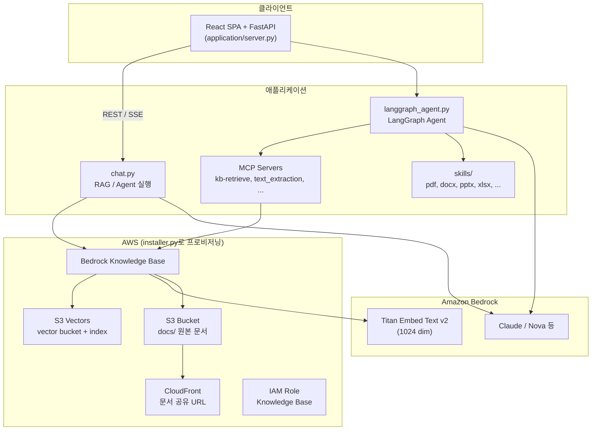

# RAG with Amazon S3 Vectors

Amazon Bedrock Knowledge Base와 **Amazon S3 Vectors**를 벡터 스토어로 사용하는 RAG(Retrieval-Augmented Generation) 애플리케이션입니다. FastAPI + React UI에서 Skill/MCP Agent 채팅, RAG 문서 업로드, 이미지 첨부 등을 제공합니다.


## 목차

1. [S3 Vectors 개요](#s3-vectors-개요) — 개념, 구성 요소, 성능·통합·사용 사례
2. [시스템 구성](#시스템-구성) — 아키텍처, 데이터 흐름, AWS 리소스, 앱 구조, UI, 예상 비용
3. [RAG의 활용](#rag의-활용) — Knowledge Base 조회, Metadata Filtering
4. [사전 요구 사항](#사전-요구-사항)
5. [설치](#설치--installerpy) — `installer.py`, 문서 인덱싱
6. [애플리케이션 실행](#애플리케이션-실행)
7. [활용 방법](#활용-방법) — QueryVectors API 예시
8. [제거](#제거--uninstallerpy) — `uninstaller.py`
9. [실행 결과](#실행-결과)
10. [참고 문서 링크](#참고-문서-링크)

## S3 Vectors 개요

[Amazon S3 Vectors](https://docs.aws.amazon.com/AmazonS3/latest/userguide/s3-vectors.html)는 클라우드에서 벡터를 저장·조회할 수 있는 **목적 특화(purpose-built) 객체 스토리지**입니다. AI 에이전트, 추론, RAG, 의미론적 검색(Semantic Search)을 위해 설계되었으며, Amazon S3와 동일한 탄력성·내구성·가용성을 목표로 하면서도 인프라를 프로비저닝하지 않고 전용 API로 벡터를 넣고 유사도 검색할 수 있습니다. 텍스트·이미지·오디오 등을 임베딩한 수치 벡터를 저장하면, 키워드 일치가 아닌 **의미적 근접성** 기준으로 유사 항목을 찾을 수 있습니다.

### 핵심 구성 요소

| 구성 요소 | 설명 |
|-----------|------|
| **Vector bucket** | 벡터 저장·질의에 특화된 새로운 S3 버킷 유형 |
| **Vector index** | 버킷 안에서 벡터를 조직하는 단위. 유사도 쿼리는 인덱스 단위로 수행 |
| **Vector** | 인덱스에 저장되는 임베딩. `key`로 식별하며, 필터링용 메타데이터를 함께 첨부 가능 |

인덱스 생성 시 **차원(dimension, 1~4096)** 과 거리 지표(**Cosine** 또는 **Euclidean**)를 지정하며, 생성 후에는 이름·차원·거리 지표·non-filterable 메타데이터 키를 변경할 수 없습니다. 기본 메타데이터는 필터 가능하고, 인덱스 생성 시 non-filterable로 지정한 키(예: 원문 `source_text`)는 저장만 하고 쿼리 필터에는 쓰지 않습니다.

### 성능·규모·운영 특성

- **쿼리 지연**: 비자주(infrequent) 쿼리는 서브초, 더 자주 쓰는 쿼리는 최저 약 **100ms** 수준(워크로드에 따라 상이)
- **규모**: 인덱스당 최대 약 **20억(2B)** 벡터, 버킷당 최대 **10,000** 인덱스
- **일관성**: 쓰기는 **강한 일관성(strong consistency)** — 방금 넣은 벡터를 바로 조회·검색에 반영
- **비용**: 사용량 기반 과금. AWS는 업로드·저장·쿼리 비용을 기존 대비 최대 약 **90%** 절감할 수 있다고 안내([S3 Vectors 기능 페이지](https://aws.amazon.com/s3/features/vectors/))
- **보안**: IAM·버킷 정책으로 접근 제어. 서비스 네임스페이스는 `s3vectors`. Vector bucket은 S3 Block Public Access가 항상 켜져 있으며 끌 수 없음
- **최적화**: 쓰기/갱신/삭제에 따라 내부적으로 벡터 데이터를 자동 최적화해 가격 대비 성능을 유지

고 QPS·초저지연이 필수인 실시간 검색에는 [Amazon OpenSearch Service](https://docs.aws.amazon.com/AmazonS3/latest/userguide/s3-vectors-opensearch.html)가 더 적합하고, S3 Vectors는 **장기·대용량·상대적으로 쿼리 빈도가 낮은** 벡터 저장에 비용 효율이 좋습니다. OpenSearch와 계층형(tiered)으로 쓰는 패턴도 지원합니다.

### AWS 서비스 통합

- **Amazon Bedrock Knowledge Bases**: S3 Vectors를 벡터 스토어로 선택해 RAG 저장 비용을 낮출 수 있음 (본 프로젝트에서 사용)
- **Amazon SageMaker Unified Studio**: Bedrock Knowledge Base를 S3 Vectors와 함께 개발·테스트
- **Amazon OpenSearch Service**: 고급 검색(하이브리드, aggregation 등)이 필요할 때 S3 Vectors와 연동하거나 스냅샷을 OpenSearch Serverless로 보내 고성능 검색에 활용

### 대표 사용 사례

의미론적 문서 검색, RAG, AI 에이전트 장기 메모리, 이미지/비디오 유사도 검색, 추천·개인화, 대용량 미디어 라이브러리에서의 장면·콘텐츠 탐색, 의료 영상 유사 사례 검색 등 — **대규모 임베딩을 비용 효율적으로 유지하면서 유사도 검색**이 필요한 워크로드에 적합합니다.

참고: [What is Amazon S3 Vectors?](https://docs.aws.amazon.com/AmazonS3/latest/userguide/s3-vectors.html) · [Getting started](https://docs.aws.amazon.com/AmazonS3/latest/userguide/s3-vectors-getting-started.html) · [Limitations](https://docs.aws.amazon.com/AmazonS3/latest/userguide/s3-vectors-limitations.html)

## 시스템 구성

### 아키텍처


```mermaid
flowchart TB
    subgraph Client["클라이언트"]
        UI["React SPA + FastAPI<br/>(application/server.py)"]
    end

    subgraph App["애플리케이션"]
        Chat["chat.py<br/>RAG / Agent 실행"]
        Agent["langgraph_agent.py<br/>LangGraph Agent"]
        MCP["MCP Servers<br/>kb-retrieve, text_extraction, ..."]
        Skills["skills/<br/>pdf, docx, pptx, xlsx, ..."]
    end

    subgraph AWS["AWS (installer.py로 프로비저닝)"]
        KB["Bedrock Knowledge Base"]
        S3V["S3 Vectors<br/>vector bucket + index"]
        S3["S3 Bucket<br/>docs/ 원본 문서"]
        CF["CloudFront<br/>문서 공유 URL"]
        IAM["IAM Role<br/>Knowledge Base"]
    end

    subgraph Models["Amazon Bedrock"]
        Embed["Titan Embed Text v2<br/>(1024 dim)"]
        LLM["Claude / Nova 등"]
    end

    UI -->|REST / SSE| Chat
    UI --> Agent
    Agent --> MCP
    Agent --> Skills
    Chat --> KB
    MCP --> KB
    KB --> S3V
    KB --> Embed
    KB --> S3
    Chat --> LLM
    Agent --> LLM
    S3 --> CF
```

### 데이터 흐름 (RAG)

1. 원본 문서를 S3 버킷의 `docs/` prefix에 업로드합니다.
2. Bedrock Knowledge Base가 문서를 청킹·임베딩하여 **S3 Vectors** 인덱스에 저장합니다.
3. 사용자 질의 시 `bedrock-agent-runtime`의 `retrieve` API로 관련 청크를 검색합니다.
4. 검색 결과를 LLM 컨텍스트로 전달하여 답변을 생성합니다.
5. 참조 문서 URL은 CloudFront `sharing_url`을 통해 제공됩니다.

### AWS 리소스 (`installer.py`가 생성)

| 리소스 | 이름 규칙 | 설명 |
|--------|-----------|------|
| S3 버킷 (문서) | `storage-for-rag-project-{accountId}-{region}` | RAG 원본 문서 저장 (`docs/`) |
| S3 Vector 버킷 | `{projectName}-{accountId}` | 벡터 임베딩 저장 |
| S3 Vector 인덱스 | `{projectName}` | cosine, 1024 dim, float32 |
| Bedrock Knowledge Base | `{projectName}` | S3 Vectors를 벡터 스토어로 사용 |
| IAM Role | `role-knowledge-base-for-{projectName}-{region}` | KB용 Bedrock/S3/S3Vectors 권한 |
| CloudFront | `CloudFront-for-rag-project` | S3 문서 정적 배포 (공유 URL) |
| Secrets Manager | `tavilyapikey-{projectName}` 등 | 외부 API 키 (선택, 현재 installer에서 주석 처리) |

기본 설정: `projectName = rag-s3-vector`, `region = us-west-2`, 임베딩 모델 `amazon.titan-embed-text-v2:0`.

### 애플리케이션 구조

```
rag-s3-vector/
├── installer.py             # AWS 인프라 프로비저닝
├── uninstaller.py           # AWS 인프라 삭제
├── run_local.sh             # 프론트 빌드 + uvicorn :8501
├── Dockerfile               # FastAPI + React 컨테이너
├── requirements.txt
└── application/
    ├── server.py            # FastAPI 진입점 + SPA 서빙
    ├── api/                 # REST / SSE 라우트
    ├── web/                 # Vite + React UI
    ├── chat.py              # RAG / Agent 실행 (run_agent)
    ├── langgraph_agent.py   # LangGraph Agent (SKILL + MCP)
    ├── mcp_config.py        # MCP 서버 설정
    ├── mcp_retrieve.py      # Knowledge Base retrieve
    ├── mcp_server_retrieve.py
    ├── mcp_server_text_extraction.py
    ├── config.json          # installer가 갱신하는 런타임 설정
    ├── skills/              # Agent용 SKILL (pdf, docx, pptx, xlsx 등)
    ├── contents/            # 로컬 문서 (선택)
    └── artifacts/           # Agent 실행 결과물
```

### UI 기능

| 기능 | 설명 |
|------|------|
| Agent 채팅 | Skill + MCP를 활용한 LangGraph Agent (SSE 스트리밍) |
| 멀티 태스크 | 사이드바에서 대화방 생성/핀/이름변경/삭제 |
| Skill / MCP 선택 | `skills.list` / `mcp.list` 기반 토글, favorite 저장 |
| RAG 업로드 | PDF 등 문서 → S3 + Knowledge Base ingestion |
| 이미지 첨부 | 클립보드/파일 업로드 → S3 URL 첨부 |
| 로컬 User ID | 쿠키 세션으로 사용자별 대화·업로드 구분 |

### 예상 비용

여기서 적용한 RAG의 구조는  **Customer-managed Knowledge Base + S3 Vectors** 조합입니다. KB 기능 자체에 별도 요금이 없고, **벡터 스토어(S3 Vectors) + 임베딩/추론 모델 + 원본 S3** 사용량에 과금됩니다 ([Bedrock Pricing](https://aws.amazon.com/bedrock/pricing/), [Prescriptive Guidance — Cost](https://docs.aws.amazon.com/prescriptive-guidance/latest/choosing-an-aws-vector-database-for-rag-use-cases/cost.html)). AWS는 S3 Vectors로 업로드·저장·쿼리 비용을 기존 대비 최대 약 **90%** 절감할 수 있다고 안내합니다 ([KB + S3 Vectors 블로그](https://aws.amazon.com/blogs/machine-learning/building-cost-effective-rag-applications-with-amazon-bedrock-knowledge-bases-and-amazon-s3-vectors/), [S3 Vectors 기능](https://aws.amazon.com/s3/features/vectors/)).

#### 비용 구성

| 항목 | 과금 기준 | 참고 |
|------|-----------|------|
| S3 Vectors 스토리지 | GB-month (벡터 데이터 + 메타데이터 + key) | 1024차원 ≈ 4 KB/벡터 (4 bytes × 1024) |
| S3 Vectors PUT | 업로드 logical GB (`$0.20`/GB, PUT당 최소 128 KB) | 배치 PUT으로 단가 절감 |
| S3 Vectors 쿼리 | 요청 수 + 처리 데이터(TB) + 반환 데이터(GB) | non-filterable 메타는 처리량에서 제외. 쿼리당 반환 첫 512 KB 무료 |
| Bedrock 임베딩 | 인제스션·쿼리 임베딩 토큰 | 예: Titan Text Embeddings V2 |
| Bedrock 응답 생성 | RetrieveAndGenerate / Agent LLM 토큰 | 모델별 On-Demand 단가 |
| 원본 문서 S3 | 표준 S3 스토리지·요청 | 데이터 소스 버킷 |

단가·예시는 [Amazon S3 pricing — Vectors](https://aws.amazon.com/s3/pricing/) (US East (N. Virginia)) 기준입니다. 리전·약정·사용 패턴에 따라 달라질 수 있습니다.

#### AWS 공식 RAG 비용 예시 (S3 Vectors)

[Amazon S3 pricing](https://aws.amazon.com/s3/pricing/)의 Pricing example 1·2 (RAG 워크플로)를 요약합니다. 벡터당 6.17 KB(벡터 4 KB + filterable 1 KB + non-filterable 1 KB + key 0.17 KB), 6개월마다 전체 갱신(월 PUT ≈ 16.7%), 쿼리당 top-100 반환.

| 시나리오 | 규모 | 월 쿼리 | 스토리지 | PUT | 쿼리 | **월 합계** |
|----------|------|---------|----------|-----|------|-------------|
| Example 1 | 1,000만 벡터 / 40 인덱스 (인덱스당 25만) | 100만 | $3.54 | $1.97 | $5.87 | **~$11.38** |
| Example 2 | 5억 벡터 / 40 인덱스 (인덱스당 1,250만) | 1,000만 | $176.52 | $98.07 | $1,045.88 | **~$1,320.47** |

쿼리 단가 구성(공식 예시): API `$2.50`/백만 쿼리 + data processed(인덱스 규모 티어: `$0.004` / `$0.002` / `$0.0004` per TB) + data returned `$0.01`/GB. Example 1·2는 반환량이 무료 구간(쿼리당 약 500 KB) 이하여 반환 요금 $0입니다.

> 위 수치는 **S3 Vectors만**의 예측입니다. Knowledge Base 인제스션 임베딩·RetrieveAndGenerate LLM·원본 S3 요금은 별도로 더해집니다. 세부 산식은 [S3 pricing — Vectors](https://aws.amazon.com/s3/pricing/)를, 통합 절차·비용 절감 맥락은 [Using S3 Vectors with Amazon Bedrock Knowledge Bases](https://docs.aws.amazon.com/AmazonS3/latest/userguide/s3-vectors-bedrock-kb.html)와 [KB + S3 Vectors 블로그](https://aws.amazon.com/blogs/machine-learning/building-cost-effective-rag-applications-with-amazon-bedrock-knowledge-bases-and-amazon-s3-vectors/)를 참고하세요. 워크로드별 견적은 [AWS Pricing Calculator](https://calculator.aws/)로 재산정하는 것이 좋습니다.

## RAG의 활용

### Knowledge Base 조회

채팅 Agent가 MCP 도구 `retrieve`를 호출하면 Bedrock Knowledge Base `Retrieve` API로 S3 Vectors 인덱스를 의미 검색합니다. UI에서 MCP **knowledge base**(`kb-retrieve`)를 켠 뒤, 예: *"knowledge base로 보일러 에러 코드 검토하세요."* 처럼 요청하면 이 경로가 사용됩니다 ([실행 결과](#실행-결과)).

#### 호출 흐름

```text
UI 채팅 → langgraph_agent
  → MCP stdio: mcp_server_retrieve.py (도구 retrieve)
    → mcp_retrieve.retrieve(keyword)
      → bedrock-agent-runtime.retrieve (knowledgeBaseId from config.json)
```

| 단계 | 파일 | 역할 |
|------|------|------|
| MCP 등록 | [`application/mcp_config.py`](application/mcp_config.py) | `kb-retrieve` → `python …/mcp_server_retrieve.py` |
| Agent 연결 | [`application/langgraph_agent.py`](application/langgraph_agent.py) | 선택 MCP 로드, `RAG_USER_ID` 환경변수 주입 |
| MCP 도구 | [`application/mcp_server_retrieve.py`](application/mcp_server_retrieve.py) | FastMCP `@mcp.tool() retrieve(keyword)` |
| KB 조회 | [`application/mcp_retrieve.py`](application/mcp_retrieve.py) | `bedrock-agent-runtime.retrieve` + 결과 JSON 변환 |
| (대안) 직접 RAG | [`application/chat.py`](application/chat.py) | `retrieve` / `run_rag_with_knowledge_base` — MCP 없이 동일 API |

`knowledge_base_id`는 [`application/config.json`](application/config.json)에 있으며, `installer.py`가 생성·갱신합니다.

#### 핵심 코드

1) MCP 도구 노출 — [`mcp_server_retrieve.py`](application/mcp_server_retrieve.py)

```python
@mcp.tool()
def retrieve(keyword: str) -> str:
    """Query the keyword using RAG based on the knowledge base."""
    return mcp_retrieve.retrieve(keyword)
```

2) Bedrock `Retrieve` 호출 — [`mcp_retrieve.py`](application/mcp_retrieve.py)

```python
response = bedrock_agent_runtime_client.retrieve(
    retrievalQuery={"text": query},
    knowledgeBaseId=knowledge_base_id,
    retrievalConfiguration={
        "vectorSearchConfiguration": {"numberOfResults": number_of_results},  # 기본 5
    },
)
```

반환의 `retrievalResults[]`에서 `content.text`, S3 `location`, 페이지 메타(`x-amz-bedrock-kb-document-page-number`)를 읽어 아래 JSON 문자열로 돌려줍니다.

```json
[
  {
    "contents": "검색된 청크 텍스트…",
    "reference": {
      "url": "https://…/docs/error_code.pdf",
      "title": "error_code.pdf",
      "from": "RAG",
      "page": 3
    }
  }
]
```

KB ID가 없거나 stale이면 `ResourceNotFoundException` 시 `list_knowledge_bases`로 `projectName`과 이름 일치 KB를 찾아 `config.json`을 갱신한 뒤 재시도합니다 (같은 파일).

3) Agent에서 MCP 기동 — [`mcp_config.py`](application/mcp_config.py) + [`langgraph_agent.py`](application/langgraph_agent.py)

```python
# mcp_config.load_config("kb-retrieve") 요약
"kb-retrieve": {
    "command": "python",
    "args": [f"{workingDir}/mcp_server_retrieve.py"],
}
```

```python
# langgraph_agent: 세션 사용자 스코프를 MCP env로 전달
env["RAG_USER_ID"] = session_user_id
```

메타데이터 필터(`vectorSearchConfiguration.filter`)를 붙이는 예는 아래 [Bedrock Knowledge Base Retrieve 필터](#bedrock-knowledge-base-retrieve-필터-s3-vectors-백엔드)를 참고하세요. 현재 `mcp_retrieve.retrieve`는 `numberOfResults`만 설정합니다.

4) MCP 없이 동일 API — [`chat.py`](application/chat.py)

`chat.retrieve(query)`는 위와 같은 `bedrock-agent-runtime.retrieve` 호출입니다. `run_rag_with_knowledge_base`는 검색 결과를 컨텍스트로 묶어 LLM에 넘깁니다.

```python
json_docs = retrieve(query)
relevant_docs = json.loads(json_docs)
relevant_context = "".join(f"{doc['contents']}\n\n" for doc in relevant_docs)
# → get_rag_prompt 체인에 question + context 로 전달
```

S3 Vectors를 **KB 없이** 직접 질의하려면 [활용 방법](#활용-방법)의 `QueryVectors` 예시를 사용합니다.


### Metadata Filtering (S3 Vectors + Bedrock Knowledge Bases)

Amazon Bedrock Knowledge Bases는 원본 문서와 함께 `파일명.확장자.metadata.json` sidecar를 S3에 올리면 문서별 커스텀 메타데이터를 인덱싱합니다.
조회 시 `Retrieve`의 `vectorSearchConfiguration.filter`로 사전 필터링한 뒤 유사도 검색을 수행합니다. 벡터 스토어가 **S3 Vectors**일 때도 sidecar → 인제스션 → 필터 조회 흐름은 동일하며, 필터 연산자·크기 제한은 스토어별로 다릅니다.

- Bedrock: [Include metadata](https://docs.aws.amazon.com/bedrock/latest/userguide/kb-metadata.html) · [Configure queries / metadata filters](https://docs.aws.amazon.com/bedrock/latest/userguide/kb-test-config.html)
- S3 Vectors: [Metadata filtering](https://docs.aws.amazon.com/AmazonS3/latest/userguide/s3-vectors-metadata-filtering.html) · [Querying vectors](https://docs.aws.amazon.com/AmazonS3/latest/userguide/s3-vectors-query.html) · [Limitations](https://docs.aws.amazon.com/AmazonS3/latest/userguide/s3-vectors-limitations.html)

이 프로젝트는 UI/API RAG 업로드 시 `application/services/rag_service.py`가
`docs/{projectName}/{user_id}/{file}` 와 함께 `{file}.metadata.json` sidecar를 업로드합니다.
`installer.py`는 Bedrock KB용 non-filterable 키(`AMAZON_BEDROCK_TEXT`, `AMAZON_BEDROCK_METADATA`)를 인덱스에 미리 등록합니다.

#### 본 프로젝트 sidecar 스키마

Bedrock이 지원하는 타입은 `STRING` / `NUMBER` / `BOOLEAN` / `STRING_LIST` 입니다.

| 속성 | 타입 | 예시 | 용도 |
|------|------|------|------|
| `owner` | `STRING_LIST` | `["user01"]` | 업로더 `user_id` (list/멤버십 필터) |
| `team` | `STRING` | `"mycompany"` | 팀/조직 스코프 |
| `created_time` | `NUMBER` | `1786366000` | Unix epoch(초). 범위 필터용 |
| `is_confidential` | `BOOLEAN` | `false` | 기밀 여부 |

메타데이터 파일 예시:

```json
{
  "metadataAttributes": {
    "owner": {
      "value": { "type": "STRING_LIST", "stringListValue": ["user01"] },
      "includeForEmbedding": false
    },
    "team": {
      "value": { "type": "STRING", "stringValue": "mycompany" },
      "includeForEmbedding": false
    },
    "created_time": {
      "value": { "type": "NUMBER", "numberValue": 1786366000 },
      "includeForEmbedding": false
    },
    "is_confidential": {
      "value": { "type": "BOOLEAN", "booleanValue": false },
      "includeForEmbedding": false
    }
  }
}
```

모든 속성은 `includeForEmbedding: false`로 두어 **필터 전용**으로 씁니다.

#### S3 Vectors 네이티브 메타데이터 필터

S3 Vectors는 **filterable** / **non-filterable** 두 종류를 지원합니다.

| 구분 | 특징 |
|------|------|
| **Filterable** (기본) | `QueryVectors`의 `filter`에 사용. 타입: string, number, boolean, list. 벡터당 **최대 약 2 KB** |
| **Non-filterable** | 인덱스 생성 시 키를 명시. 필터 불가·크기 여유. 원문 청크 등 컨텍스트 저장용. `returnMetadata`로 조회 가능 |

기타 한도(요약): 벡터당 메타데이터 합계 최대 **40 KB**, 키 최대 **50**개, non-filterable 키 인덱스당 최대 **10**개. 한도 초과 시 `PutVectors`가 `400 Bad Request`를 반환합니다.

유사도 검색과 필터는 **동시에** 평가됩니다(검색 후 후처리가 아님). 매칭 결과가 적으면 `topK`보다 적은 결과가 반환될 수 있습니다. non-filterable 키로 필터하면 `400 Bad Request`입니다.

- `QueryVectors` 필터 연산자

[AWS 문서](https://docs.aws.amazon.com/AmazonS3/latest/userguide/s3-vectors-metadata-filtering.html) 기준:

| 연산자 | 입력 타입 | 설명 |
|--------|-----------|------|
| `$eq` | String, Number, Boolean | 일치. 메타데이터가 **배열**이면 원소 중 하나와 같으면 true |
| `$ne` | String, Number, Boolean | 불일치 |
| `$gt` / `$gte` / `$lt` / `$lte` | Number | 대소 비교 |
| `$in` / `$nin` | 비어 있지 않은 primitive 배열 | 배열에 포함 / 미포함 |
| `$exists` | Boolean | 해당 메타데이터 키 존재 여부 |
| `$and` / `$or` | 필터 배열 | 논리 AND / OR |

연산자를 생략하면 `$eq`로 처리됩니다. 예: `{ "genre": "documentary" }` ≡ `{ "genre": { "$eq": "documentary" } }`.

```python
# 단순 동등
{"genre": "scifi"}

# 명시적 연산자
{"genre": {"$eq": "documentary"}}
{"genre": {"$ne": "drama"}}
{"year": {"$gte": 2020}}
{"genre": {"$in": ["comedy", "documentary"]}}
{"genre": {"$exists": true}}

# 논리 조합 / 동일 필드 범위
{"$and": [{"genre": {"$eq": "drama"}}, {"year": {"$gte": 2020}}]}
{"price": {"$gte": 10, "$lte": 50}}
```

배열 메타데이터 예: `"category": ["documentary", "romance"]` 인 벡터는 `{ "category": { "$eq": "documentary" } }` 에 매칭됩니다.

#### Bedrock Knowledge Base `Retrieve` 필터 (S3 Vectors 백엔드)

Knowledge Base API는 Bedrock 필터 이름을 사용합니다. S3 Vectors를 벡터 스토어로 쓸 때:

- **`startsWith`**, **`stringContains`** 는 **사용할 수 없습니다** ([Configure queries](https://docs.aws.amazon.com/bedrock/latest/userguide/kb-test-config.html)).
- `equals` / `notEquals` / `greaterThan` / `greaterThanOrEquals` / `lessThan` / `lessThanOrEquals` 및 `andAll` / `orAll` 조합을 사용합니다.
- `in` / `notIn` / `listContains` 는 문서상 OpenSearch Serverless 등에서 가장 잘 지원됩니다. S3 Vectors에서는 동일 효과를 **네이티브 `$eq` / `$in`**(배열 메타데이터) 또는 Bedrock `equals`로 검증하는 것이 안전합니다.

```python
retrievalConfiguration={
    "vectorSearchConfiguration": {
        "numberOfResults": 5,
        "filter": {
            "andAll": [
                {"equals": {"key": "team", "value": "mycompany"}},
                {"greaterThanOrEquals": {"key": "created_time", "value": 1700000000}},
                {"equals": {"key": "is_confidential", "value": False}},
            ]
        },
    }
}
```

`STRING_LIST`인 `owner`에 대해 OpenSearch 계열에서는 `listContains`를 쓰는 패턴이 일반적입니다.

```python
"filter": {
    "listContains": {"key": "owner", "value": "<user_id>"}
}
```

S3 Vectors `QueryVectors`에서는 동일 의도를 예를 들어 다음처럼 표현할 수 있습니다(`$eq`가 리스트 원소와 매칭).

```python
filter={"owner": {"$eq": "user01"}}
# 또는
filter={"owner": {"$in": ["user01"]}}
```

#### 검색 설정 요약

| 경로 | 검색 | 필터 |
|------|------|------|
| Bedrock `Retrieve` | 의미 검색 (S3 Vectors 인덱스) | Bedrock 필터 JSON (`equals`, 범위, `andAll`/`orAll` …). `startsWith`/`stringContains` 불가 |
| S3 Vectors `QueryVectors` | 임베딩 유사도 + 동시 메타데이터 평가 | `$eq`, `$gt`, `$in`, `$and` … |

Agent 경로에서는 `langgraph_agent`가 RAG MCP(`kb-retrieve`)에 `RAG_USER_ID`를 주입해 사용자 스코프를 넘길 수 있습니다. 업로드 시 sidecar의 `owner`가 그 사용자 ID로 채워집니다.


## 설치 및 배포


### 사전 요구 사항

- Python 3.10+
- Node.js 20+ (React 프론트 빌드)
- AWS CLI 자격 증명 구성 (`aws configure` 또는 환경 변수)
- `us-west-2` 리전에서 Bedrock 모델 및 S3 Vectors 사용 권한
- (선택) `uv` (aws_documentation MCP), `npx` (web_fetch MCP)

### 설치 — `installer.py`

`installer.py`는 boto3로 CDK 없이 AWS 리소스를 생성합니다.

```bash
pip install boto3
python installer.py
```

#### 실행 순서

| 단계 | 작업 |
|------|------|
| 1 | (선택) Secrets Manager — Tavily API 키 등 (`create_secrets`, 현재 주석 처리) |
| 2 | S3 버킷 생성 — CORS, `docs/` prefix |
| 3 | IAM Role — Knowledge Base용 (Bedrock, S3, S3Vectors 인라인 정책) |
| 4 | S3 Vectors — vector bucket + index 생성 |
| 5 | Bedrock Knowledge Base — S3 Vectors 연동, S3 data source (`docs/`) |
| 6 | CloudFront — S3 OAI, 문서 공유 URL |

완료 후 `application/config.json`이 자동 갱신됩니다.

```json
{
  "projectName": "rag-s3-vector",
  "accountId": "...",
  "region": "us-west-2",
  "knowledge_base_id": "...",
  "knowledge_base_role": "arn:aws:iam::...:role/...",
  "vector_bucket_name": "rag-s3-vector-{accountId}",
  "vector_bucket_arn": "arn:aws:s3vectors:...",
  "vector_index_name": "rag-s3-vector",
  "vector_index_arn": "arn:aws:s3vectors:.../index/rag-s3-vector",
  "s3_bucket": "storage-for-rag-project-{accountId}-us-west-2",
  "s3_arn": "arn:aws:s3:::...",
  "sharing_url": "https://....cloudfront.net"
}
```

> CloudFront 배포는 완전히 활성화되기까지 15~20분 정도 걸릴 수 있습니다.

#### 문서 인덱싱

1. 문서를 S3 버킷 `docs/`에 업로드합니다.
2. Bedrock 콘솔 또는 API에서 Knowledge Base **Sync**를 실행합니다.

### 애플리케이션 실행

```bash
pip install -r requirements.txt

# 프론트 빌드 후 uvicorn (포트 8501)
./run_local.sh
```

브라우저에서 http://localhost:8501 을 엽니다. 로컬 User ID로 세션을 만든 뒤 Skill/MCP와 모델을 선택하고 Agent 채팅을 사용합니다.

개발 시 React HMR:

```bash
# 터미널 1 — API
uvicorn application.server:app --host 0.0.0.0 --port 8501

# 터미널 2 — Vite ( /api 프록시 → 8501 )
cd application/web && npm install && npm run dev
```

### 활용 방법

QueryVectors API로 유사도 검색을 수행합니다. 주요 파라미터는 쿼리 벡터, `topK`, 인덱스(버킷/이름 또는 ARN), 선택적 **메타데이터 `filter`** 입니다. 필터 문법·한도는 [Metadata Filtering](#metadata-filtering-s3-vectors--bedrock-knowledge-bases)을 참고하세요.

```python
import boto3 
import json 

# Bedrock Runtime 및 S3 Vectors 클라이언트 생성
bedrock = boto3.client("bedrock-runtime", region_name="us-west-2")
s3vectors = boto3.client("s3vectors", region_name="us-west-2") 

# 쿼리 텍스트를 임베딩으로 변환
input_text = "adventures in space"
response = bedrock.invoke_model(
    modelId="amazon.titan-embed-text-v2:0",
    body=json.dumps({"inputText": input_text})
) 

# 임베딩 추출 및 벡터 검색
model_response = json.loads(response["body"].read())
embedding = model_response["embedding"]

# 벡터 인덱스 쿼리
response = s3vectors.query_vectors(
    vectorBucketName="rag-s3-vector-{accountId}",
    indexName="rag-s3-vector",
    queryVector={"float32": embedding}, 
    topK=3, 
    returnDistance=True,
    returnMetadata=True
)

# 메타데이터 필터와 함께 쿼리 (team + created_time 범위 예시)
response = s3vectors.query_vectors(
    vectorBucketName="rag-s3-vector-{accountId}",
    indexName="rag-s3-vector",
    queryVector={"float32": embedding},
    topK=3,
    filter={
        "$and": [
            {"team": {"$eq": "mycompany"}},
            {"created_time": {"$gte": 1700000000}},
            {"is_confidential": {"$eq": False}},
        ]
    },
    returnDistance=True,
    returnMetadata=True,
)
```

## 제거 — `uninstaller.py`

`uninstaller.py`는 `installer.py`가 생성한 리소스를 삭제합니다.

```bash
python uninstaller.py
```

#### 삭제 대상

**기본 삭제 (프로젝트 전용):**

- Bedrock Knowledge Base 및 data source
- S3 Vector index / vector bucket
- Knowledge Base IAM Role
- Secrets Manager (있는 경우)
- `application/config.json`의 installer 관리 필드

**선택 삭제 (공유 리소스, 기본값: 유지):**

- S3 문서 버킷 (`--delete-s3-bucket`)
- CloudFront 배포 및 OAI (`--delete-cloudfront`)

#### 옵션

```bash
# 확인 프롬프트 없이 프로젝트 리소스만 삭제
python uninstaller.py --yes

# S3 버킷까지 삭제
python uninstaller.py --delete-s3-bucket

# CloudFront까지 삭제 (비활성화 후 삭제, 수 분 소요)
python uninstaller.py --delete-cloudfront

# 전체 삭제
python uninstaller.py --yes --delete-s3-bucket --delete-cloudfront
```

> CloudFront는 비활성화 후 배포가 완전히 내려가야 삭제됩니다. 삭제가 건너뛰어지면 `--delete-cloudfront`로 재실행하세요.


## 실행 결과

채팅창의 '+' 버튼을 눌러서 [Upload to RAG]를 선택후 파일을 업로드 합니다. 업로드후 Amazon S3를 보면 아래와 같이 업로드한 "error_code.pdf"에 더해 "error_code.pdf.metadata.json"가 업로드 됩니다. sidecar 스키마·필터 연산자는 [Metadata Filtering](#metadata-filtering-s3-vectors--bedrock-knowledge-bases)을 참고하세요.


이때, "error_code.pdf.metadata.json"에는 아래와 같이 문서의 owner, team과 함께 생성시간 정보가 함께 기입됩니다.

```json
{
  "metadataAttributes": {
    "owner": {
      "value": {
        "type": "STRING_LIST",
        "stringListValue": [
          "user01"
        ]
      },
      "includeForEmbedding": false
    },
    "team": {
      "value": {
        "type": "STRING",
        "stringValue": "mycompany"
      },
      "includeForEmbedding": false
    },
    "created_time": {
      "value": {
        "type": "NUMBER",
        "numberValue": 1786452602
      },
      "includeForEmbedding": false
    },
    "is_confidential": {
      "value": {
        "type": "BOOLEAN",
        "booleanValue": false
      },
      "includeForEmbedding": false
    }
  }
}
```

이후 "knowledge base로 보일러 에러 코드 검토하세요."라고 입력하면 아래와 같은 결과를 얻을 수 있습니다. 이때 Knowledge Base를 조회하는 retrieve tool이 이용되었습니다.


## 참고 문서 링크

[Working with S3 Vectors and vector buckets](https://docs.aws.amazon.com/AmazonS3/latest/userguide/s3-vectors.html)

[Metadata filtering (S3 Vectors)](https://docs.aws.amazon.com/AmazonS3/latest/userguide/s3-vectors-metadata-filtering.html)

[Querying vectors](https://docs.aws.amazon.com/AmazonS3/latest/userguide/s3-vectors-query.html)

[Limitations and restrictions (S3 Vectors)](https://docs.aws.amazon.com/AmazonS3/latest/userguide/s3-vectors-limitations.html)

[boto3 - create_vector_bucket](https://boto3.amazonaws.com/v1/documentation/api/latest/reference/services/s3vectors/client/create_vector_bucket.html)

[Amazon Bedrock Knowledge Bases](https://docs.aws.amazon.com/bedrock/latest/userguide/knowledge-base.html)

[Include metadata in a data source](https://docs.aws.amazon.com/bedrock/latest/userguide/kb-metadata.html)

[Configure and customize queries (metadata filters)](https://docs.aws.amazon.com/bedrock/latest/userguide/kb-test-config.html)
