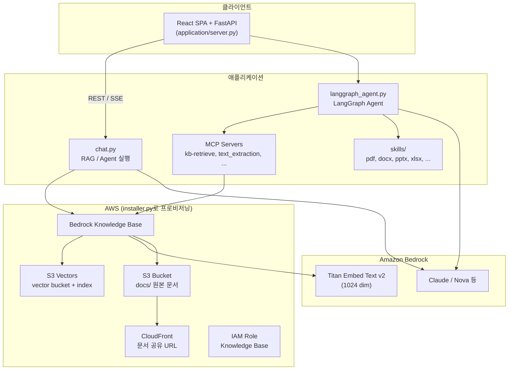

# RAG with Amazon S3 Vectors

Amazon Bedrock Knowledge Base와 **Amazon S3 Vectors**를 벡터 스토어로 사용하는 RAG(Retrieval-Augmented Generation) 애플리케이션입니다. FastAPI + React UI에서 Skill/MCP Agent 채팅, RAG 문서 업로드, 이미지 첨부 등을 제공합니다.

## 목차

1. [S3 Vectors 개요](#s3-vectors-개요) — 개념, 구성 요소, 성능·통합·사용 사례
2. [시스템 구성](#시스템-구성) — 아키텍처, 데이터 흐름, AWS 리소스, 앱 구조, UI
3. [사전 요구 사항](#사전-요구-사항)
4. [설치](#설치--installerpy) — `installer.py`, 문서 인덱싱
5. [애플리케이션 실행](#애플리케이션-실행)
6. [활용 방법](#활용-방법) — QueryVectors API 예시
7. [제거](#제거--uninstallerpy) — `uninstaller.py`
8. [참고 문서 링크](#참고-문서-링크)

## S3 Vectors 개요

[Amazon S3 Vectors](https://docs.aws.amazon.com/AmazonS3/latest/userguide/s3-vectors.html)는 클라우드에서 벡터를 저장·조회할 수 있는 **목적 특화(purpose-built) 객체 스토리지**입니다. AI 에이전트, 추론, RAG, 의미론적 검색(Semantic Search)을 위해 설계되었으며, Amazon S3와 동일한 탄력성·내구성·가용성을 목표로 하면서도 인프라를 프로비저닝하지 않고 전용 API로 벡터를 넣고 유사도 검색할 수 있습니다. 텍스트·이미지·오디오 등을 임베딩한 수치 벡터를 저장하면, 키워드 일치가 아닌 **의미적 근접성** 기준으로 유사 항목을 찾을 수 있습니다.

### 핵심 구성 요소

| 구성 요소 | 설명 |
|-----------|------|
| **Vector bucket** | 벡터 저장·질의에 특화된 새로운 S3 버킷 유형 |
| **Vector index** | 버킷 안에서 벡터를 조직하는 단위. 유사도 쿼리는 인덱스 단위로 수행 |
| **Vector** | 인덱스에 저장되는 임베딩. `key`로 식별하며, 필터링용 메타데이터를 함께 첨부 가능 |

인덱스 생성 시 **차원(dimension, 1~4096)** 과 거리 지표(**Cosine** 또는 **Euclidean**)를 지정하며, 생성 후에는 이름·차원·거리 지표·non-filterable 메타데이터 키를 변경할 수 없습니다. 기본 메타데이터는 필터 가능하고, 인덱스 생성 시 non-filterable로 지정한 키(예: 원문 `source_text`)는 저장만 하고 쿼리 필터에는 쓰지 않습니다.

### 성능·규모·운영 특성

- **쿼리 지연**: 비자주(infrequent) 쿼리는 서브초, 더 자주 쓰는 쿼리는 최저 약 **100ms** 수준(워크로드에 따라 상이)
- **규모**: 인덱스당 최대 약 **20억(2B)** 벡터, 버킷당 최대 **10,000** 인덱스
- **일관성**: 쓰기는 **강한 일관성(strong consistency)** — 방금 넣은 벡터를 바로 조회·검색에 반영
- **비용**: 사용량 기반 과금. AWS는 업로드·저장·쿼리 비용을 기존 대비 최대 약 **90%** 절감할 수 있다고 안내([S3 Vectors 기능 페이지](https://aws.amazon.com/s3/features/vectors/))
- **보안**: IAM·버킷 정책으로 접근 제어. 서비스 네임스페이스는 `s3vectors`. Vector bucket은 S3 Block Public Access가 항상 켜져 있으며 끌 수 없음
- **최적화**: 쓰기/갱신/삭제에 따라 내부적으로 벡터 데이터를 자동 최적화해 가격 대비 성능을 유지

고 QPS·초저지연이 필수인 실시간 검색에는 [Amazon OpenSearch Service](https://docs.aws.amazon.com/AmazonS3/latest/userguide/s3-vectors-opensearch.html)가 더 적합하고, S3 Vectors는 **장기·대용량·상대적으로 쿼리 빈도가 낮은** 벡터 저장에 비용 효율이 좋습니다. OpenSearch와 계층형(tiered)으로 쓰는 패턴도 지원합니다.

### AWS 서비스 통합

- **Amazon Bedrock Knowledge Bases**: S3 Vectors를 벡터 스토어로 선택해 RAG 저장 비용을 낮출 수 있음 (본 프로젝트에서 사용)
- **Amazon SageMaker Unified Studio**: Bedrock Knowledge Base를 S3 Vectors와 함께 개발·테스트
- **Amazon OpenSearch Service**: 고급 검색(하이브리드, aggregation 등)이 필요할 때 S3 Vectors와 연동하거나 스냅샷을 OpenSearch Serverless로 보내 고성능 검색에 활용

### 대표 사용 사례

의미론적 문서 검색, RAG, AI 에이전트 장기 메모리, 이미지/비디오 유사도 검색, 추천·개인화, 대용량 미디어 라이브러리에서의 장면·콘텐츠 탐색, 의료 영상 유사 사례 검색 등 — **대규모 임베딩을 비용 효율적으로 유지하면서 유사도 검색**이 필요한 워크로드에 적합합니다.

참고: [What is Amazon S3 Vectors?](https://docs.aws.amazon.com/AmazonS3/latest/userguide/s3-vectors.html) · [Getting started](https://docs.aws.amazon.com/AmazonS3/latest/userguide/s3-vectors-getting-started.html) · [Limitations](https://docs.aws.amazon.com/AmazonS3/latest/userguide/s3-vectors-limitations.html)

## 시스템 구성

### 아키텍처


```mermaid
flowchart TB
    subgraph Client["클라이언트"]
        UI["React SPA + FastAPI<br/>(application/server.py)"]
    end

    subgraph App["애플리케이션"]
        Chat["chat.py<br/>RAG / Agent 실행"]
        Agent["langgraph_agent.py<br/>LangGraph Agent"]
        MCP["MCP Servers<br/>kb-retrieve, text_extraction, ..."]
        Skills["skills/<br/>pdf, docx, pptx, xlsx, ..."]
    end

    subgraph AWS["AWS (installer.py로 프로비저닝)"]
        KB["Bedrock Knowledge Base"]
        S3V["S3 Vectors<br/>vector bucket + index"]
        S3["S3 Bucket<br/>docs/ 원본 문서"]
        CF["CloudFront<br/>문서 공유 URL"]
        IAM["IAM Role<br/>Knowledge Base"]
    end

    subgraph Models["Amazon Bedrock"]
        Embed["Titan Embed Text v2<br/>(1024 dim)"]
        LLM["Claude / Nova 등"]
    end

    UI -->|REST / SSE| Chat
    UI --> Agent
    Agent --> MCP
    Agent --> Skills
    Chat --> KB
    MCP --> KB
    KB --> S3V
    KB --> Embed
    KB --> S3
    Chat --> LLM
    Agent --> LLM
    S3 --> CF
```

### 데이터 흐름 (RAG)

1. 원본 문서를 S3 버킷의 `docs/` prefix에 업로드합니다.
2. Bedrock Knowledge Base가 문서를 청킹·임베딩하여 **S3 Vectors** 인덱스에 저장합니다.
3. 사용자 질의 시 `bedrock-agent-runtime`의 `retrieve` API로 관련 청크를 검색합니다.
4. 검색 결과를 LLM 컨텍스트로 전달하여 답변을 생성합니다.
5. 참조 문서 URL은 CloudFront `sharing_url`을 통해 제공됩니다.

### AWS 리소스 (`installer.py`가 생성)

| 리소스 | 이름 규칙 | 설명 |
|--------|-----------|------|
| S3 버킷 (문서) | `storage-for-rag-project-{accountId}-{region}` | RAG 원본 문서 저장 (`docs/`) |
| S3 Vector 버킷 | `{projectName}-{accountId}` | 벡터 임베딩 저장 |
| S3 Vector 인덱스 | `{projectName}` | cosine, 1024 dim, float32 |
| Bedrock Knowledge Base | `{projectName}` | S3 Vectors를 벡터 스토어로 사용 |
| IAM Role | `role-knowledge-base-for-{projectName}-{region}` | KB용 Bedrock/S3/S3Vectors 권한 |
| CloudFront | `CloudFront-for-rag-project` | S3 문서 정적 배포 (공유 URL) |
| Secrets Manager | `tavilyapikey-{projectName}` 등 | 외부 API 키 (선택, 현재 installer에서 주석 처리) |

기본 설정: `projectName = rag-s3-vector`, `region = us-west-2`, 임베딩 모델 `amazon.titan-embed-text-v2:0`.

### 애플리케이션 구조

```
rag-s3-vector/
├── installer.py             # AWS 인프라 프로비저닝
├── uninstaller.py           # AWS 인프라 삭제
├── run_local.sh             # 프론트 빌드 + uvicorn :8501
├── Dockerfile               # FastAPI + React 컨테이너
├── requirements.txt
└── application/
    ├── server.py            # FastAPI 진입점 + SPA 서빙
    ├── api/                 # REST / SSE 라우트
    ├── web/                 # Vite + React UI
    ├── chat.py              # RAG / Agent 실행 (run_agent)
    ├── langgraph_agent.py   # LangGraph Agent (SKILL + MCP)
    ├── mcp_config.py        # MCP 서버 설정
    ├── mcp_retrieve.py      # Knowledge Base retrieve
    ├── mcp_server_retrieve.py
    ├── mcp_server_text_extraction.py
    ├── config.json          # installer가 갱신하는 런타임 설정
    ├── skills/              # Agent용 SKILL (pdf, docx, pptx, xlsx 등)
    ├── contents/            # 로컬 문서 (선택)
    └── artifacts/           # Agent 실행 결과물
```

### UI 기능

| 기능 | 설명 |
|------|------|
| Agent 채팅 | Skill + MCP를 활용한 LangGraph Agent (SSE 스트리밍) |
| 멀티 태스크 | 사이드바에서 대화방 생성/핀/이름변경/삭제 |
| Skill / MCP 선택 | `skills.list` / `mcp.list` 기반 토글, favorite 저장 |
| RAG 업로드 | PDF 등 문서 → S3 + Knowledge Base ingestion |
| 이미지 첨부 | 클립보드/파일 업로드 → S3 URL 첨부 |
| 로컬 User ID | 쿠키 세션으로 사용자별 대화·업로드 구분 |

## 사전 요구 사항

- Python 3.10+
- Node.js 20+ (React 프론트 빌드)
- AWS CLI 자격 증명 구성 (`aws configure` 또는 환경 변수)
- `us-west-2` 리전에서 Bedrock 모델 및 S3 Vectors 사용 권한
- (선택) `uv` (aws_documentation MCP), `npx` (web_fetch MCP)

## 설치 — `installer.py`

`installer.py`는 boto3로 CDK 없이 AWS 리소스를 생성합니다.

```bash
pip install boto3
python installer.py
```

### 실행 순서

| 단계 | 작업 |
|------|------|
| 1 | (선택) Secrets Manager — Tavily API 키 등 (`create_secrets`, 현재 주석 처리) |
| 2 | S3 버킷 생성 — CORS, `docs/` prefix |
| 3 | IAM Role — Knowledge Base용 (Bedrock, S3, S3Vectors 인라인 정책) |
| 4 | S3 Vectors — vector bucket + index 생성 |
| 5 | Bedrock Knowledge Base — S3 Vectors 연동, S3 data source (`docs/`) |
| 6 | CloudFront — S3 OAI, 문서 공유 URL |

완료 후 `application/config.json`이 자동 갱신됩니다.

```json
{
  "projectName": "rag-s3-vector",
  "accountId": "...",
  "region": "us-west-2",
  "knowledge_base_id": "...",
  "knowledge_base_role": "arn:aws:iam::...:role/...",
  "vector_bucket_name": "rag-s3-vector-{accountId}",
  "vector_bucket_arn": "arn:aws:s3vectors:...",
  "vector_index_name": "rag-s3-vector",
  "vector_index_arn": "arn:aws:s3vectors:.../index/rag-s3-vector",
  "s3_bucket": "storage-for-rag-project-{accountId}-us-west-2",
  "s3_arn": "arn:aws:s3:::...",
  "sharing_url": "https://....cloudfront.net"
}
```

> CloudFront 배포는 완전히 활성화되기까지 15~20분 정도 걸릴 수 있습니다.

### 문서 인덱싱

1. 문서를 S3 버킷 `docs/`에 업로드합니다.
2. Bedrock 콘솔 또는 API에서 Knowledge Base **Sync**를 실행합니다.

## 애플리케이션 실행

```bash
pip install -r requirements.txt

# 프론트 빌드 후 uvicorn (포트 8501)
./run_local.sh
```

브라우저에서 http://localhost:8501 을 엽니다. 로컬 User ID로 세션을 만든 뒤 Skill/MCP와 모델을 선택하고 Agent 채팅을 사용합니다.

개발 시 React HMR:

```bash
# 터미널 1 — API
uvicorn application.server:app --host 0.0.0.0 --port 8501

# 터미널 2 — Vite ( /api 프록시 → 8501 )
cd application/web && npm install && npm run dev
```

## 활용 방법

QueryVectors API를 사용하여 유사도 검색을 수행할 수 있습니다.
검색 시 지정할 수 있는 주요 파라미터에는 쿼리 벡터, 반환할 결과 수(K-최근접 이웃), 인덱스 ARN, 메타데이터 필터(선택사항)가 있습니다.

```python
import boto3 
import json 

# Bedrock Runtime 및 S3 Vectors 클라이언트 생성
bedrock = boto3.client("bedrock-runtime", region_name="us-west-2")
s3vectors = boto3.client("s3vectors", region_name="us-west-2") 

# 쿼리 텍스트를 임베딩으로 변환
input_text = "adventures in space"
response = bedrock.invoke_model(
    modelId="amazon.titan-embed-text-v2:0",
    body=json.dumps({"inputText": input_text})
) 

# 임베딩 추출 및 벡터 검색
model_response = json.loads(response["body"].read())
embedding = model_response["embedding"]

# 벡터 인덱스 쿼리
response = s3vectors.query_vectors(
    vectorBucketName="rag-s3-vector-{accountId}",
    indexName="rag-s3-vector",
    queryVector={"float32": embedding}, 
    topK=3, 
    returnDistance=True,
    returnMetadata=True
)
```

## 제거 — `uninstaller.py`

`uninstaller.py`는 `installer.py`가 생성한 리소스를 삭제합니다.

```bash
python uninstaller.py
```

### 삭제 대상

**기본 삭제 (프로젝트 전용):**

- Bedrock Knowledge Base 및 data source
- S3 Vector index / vector bucket
- Knowledge Base IAM Role
- Secrets Manager (있는 경우)
- `application/config.json`의 installer 관리 필드

**선택 삭제 (공유 리소스, 기본값: 유지):**

- S3 문서 버킷 (`--delete-s3-bucket`)
- CloudFront 배포 및 OAI (`--delete-cloudfront`)

### 옵션

```bash
# 확인 프롬프트 없이 프로젝트 리소스만 삭제
python uninstaller.py --yes

# S3 버킷까지 삭제
python uninstaller.py --delete-s3-bucket

# CloudFront까지 삭제 (비활성화 후 삭제, 수 분 소요)
python uninstaller.py --delete-cloudfront

# 전체 삭제
python uninstaller.py --yes --delete-s3-bucket --delete-cloudfront
```

> CloudFront는 비활성화 후 배포가 완전히 내려가야 삭제됩니다. 삭제가 건너뛰어지면 `--delete-cloudfront`로 재실행하세요.

## 참고 문서 링크

[Working with S3 Vectors and vector buckets](https://docs.aws.amazon.com/AmazonS3/latest/userguide/s3-vectors.html)

[boto3 - create_vector_bucket](https://boto3.amazonaws.com/v1/documentation/api/latest/reference/services/s3vectors/client/create_vector_bucket.html)

[Querying vectors](https://docs.aws.amazon.com/AmazonS3/latest/userguide/s3-vectors-query.html)

[Amazon Bedrock Knowledge Bases](https://docs.aws.amazon.com/bedrock/latest/userguide/knowledge-base.html)
